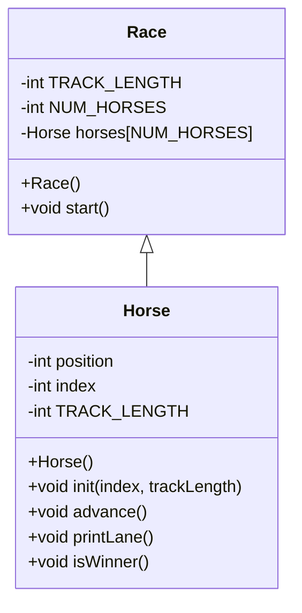

# Project 4 CS121

## UML Diagram

```mermaid
classDiagram
    class Race{
        -int TRACK_LENGTH
        -int NUM_HORSES
        -Horse horses[NUM_HORSES]
        +Race()
        +void start()
    }
    class Horse{
      -int position
      -int index
      -int TRACK_LENGTH
      +Horse()
      +void init(index, trackLength)
      +void advance()
      +void printLane()
      +void isWinner()
    }
Race <|-- Horse
```
