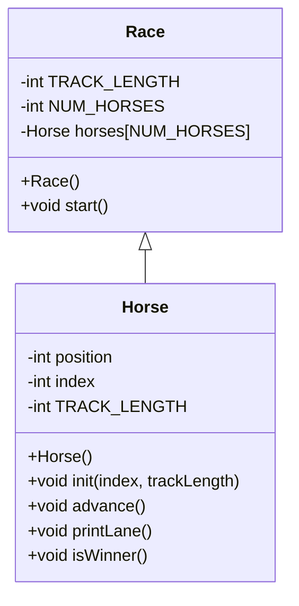

# Project 4 CS121

## UML Diagram

## Overview
- This program simualtes a horse race with horses numbered 0 through 4. Each horse starts at position 0 on a track length of 15. On each turn, every horse flips a coin which is randomly 0 or 1. If the coin is 1, the horse moves forward 1 position, otherwise it stays still. After each turn, the program prints the track with the horses positions. The race continues until 1 horse finishes the race.

## horse.cpp
- Properties
-     position - 0
-     index - 0
-     trackLength - 0
- Constructor
-     set position - 0
-     set index - 0
-     set tracklength - 0
- init(num, track)
-     set index = num for horse identity
-     set trackLength = track
-     reset position = 0
- advance()
-     generate a random step either 0 or 1
-     increase position by step
- printLane()
-     loop from pos to trackLength
-         if pos == position
-             print index
-         else
-             print . for track
- isWinner()
-     return true if position >= trackLength - 1
-     otherwise return false

## race.cpp
- Properties
-     num_horses - total number of horses
-     track_length - length of the race track
-     horses[] - array of horse objects
- Constructor
-     seed the random number generator with the current time
-     for each horse i from 0 to num_horses - 1
-         initialize horse i with:
-             index = i
-             track_length
- start()
-     set winnerFound = false
-     while winnerFound is false:
-         1. move horses
-             for each horse call advance()
-         2. print lanes
-             for each horse call printLane()
-         3. check for winner
-             for each horse, if isWinner() is true:
-                 print "Horse x wins!"
-                 set winnerFound = true
-         4. if no winner is found
-             print "Press enter for another turn"
-             wait for the user to press enter

## main.cpp
- main()
-     create a new race object called r
-     call r.start() to start the race
-     return 0 to end the program

## horse.h
- Properties
-     position - current spot of the horse on the track
-     index - unique id number of the horse
-     trackLength - total length of the race track
- horse()
-     sets default values for position, index, and track length
- init(index, tracklength)
-     assigns the horses identity and the length of the track
-     resets position to 0
- advance()
-     randomly moves the horse forward by 0 or 1 step
- printLane()
-     displays the race lane, showing the horses position
- isWinner()
-     returns true if the horse has reached the finish line

## race.h
- Properties
-     track_length - constant value for how long the race track is
-     num_horses - constant value for how many horses are in the race
-     horses[num_horses] - an array holding all horse objects in the race
- race()
-     sets up the race
- start()
-     runs the racep loop
